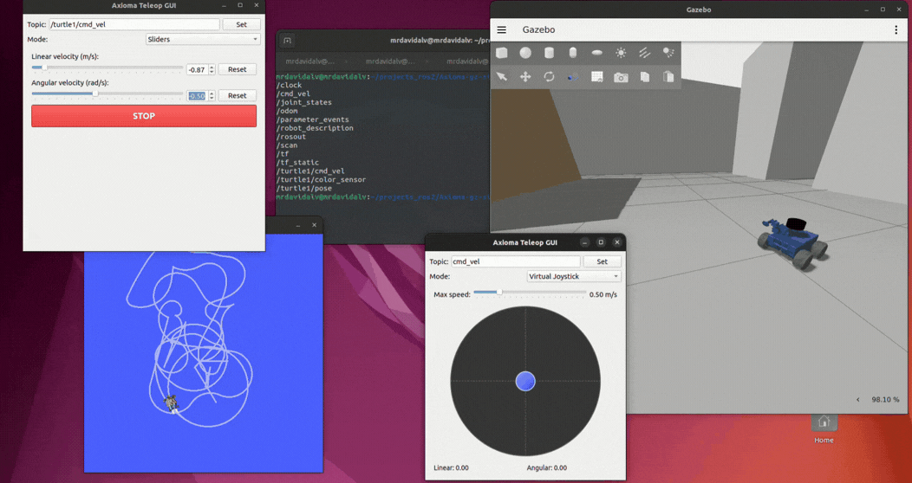
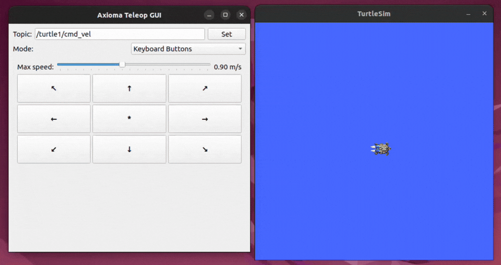
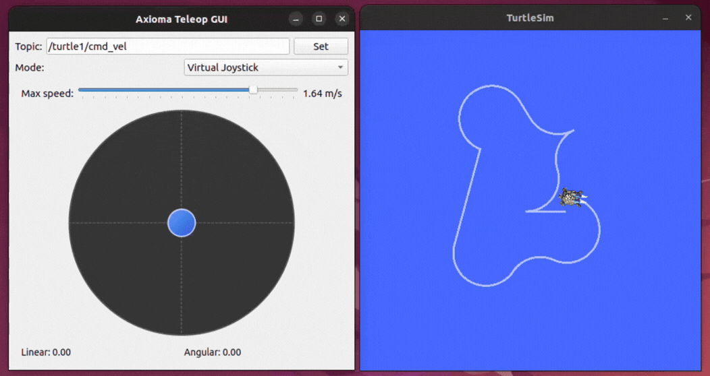
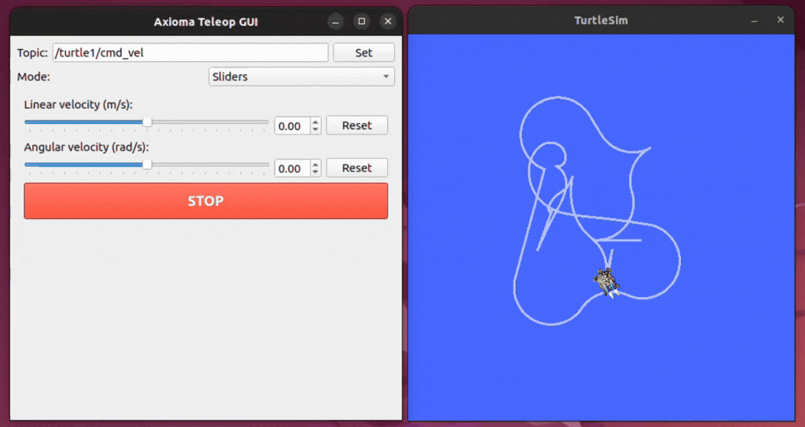

# Axioma Teleop GUI

<p align="center">
  
</p>

<p align="center">
  <a href="#"></a>
  <a href="#"></a>
  <a href="#"></a>
  <a href="#"></a>
  <a href="#"></a>
  <a href="#"></a>
</p>

A modular teleoperation GUI for ROS 2 robots. Publishes `geometry_msgs/Twist` on any configurable topic, so it works out of the box with differential-drive robots, TurtleSim, TurtleBot3, and any platform that subscribes to `cmd_vel`-style topics.

## Control Modes

### Mode 1 — Keyboard Buttons

A 3x3 directional grid that mimics the `teleop_twist_keyboard` layout. Press a button to move, release to stop. A speed slider controls the maximum velocity.

<p align="center">
  
</p>

### Mode 2 — Virtual Joystick

Drag the handle inside the circular pad to set linear and angular velocity at the same time. Distance from center controls speed. Release to stop. Numeric values are shown in real time.

<p align="center">
  
</p>

### Mode 3 — Sliders

Independent sliders for linear (-1.0 to 1.0 m/s) and angular (-3.0 to 3.0 rad/s) velocity, each with a spinbox for fine-tuning and an individual Reset button. A global STOP button zeros both axes instantly.

<p align="center">
  
</p>

## Installation

**Prerequisites:** ROS 2 Humble on Ubuntu 22.04, and PyQt5 (`sudo apt install python3-pyqt5`).

```bash
cd ~/your_ws/src
git clone https://github.com/MrDavidAlv/Axioma_teleop_gui.git
cd ~/your_ws
colcon build --packages-select axioma_teleop_gui
source install/setup.bash
```

## Usage

```bash
ros2 run axioma_teleop_gui teleop_gui
```

The GUI starts with the topic set to `cmd_vel`. You can change the target topic at any time using the text field at the top of the window.

### Quick test with TurtleSim

Open two terminals:

```bash
# Terminal 1 — launch turtlesim
ros2 run turtlesim turtlesim_node
```

```bash
# Terminal 2 — launch the GUI
ros2 run axioma_teleop_gui teleop_gui
```

In the GUI, change the topic to `/turtle1/cmd_vel` and click **Set**. Now you can drive the turtle with any of the three control modes.

## Video Demos

| Axioma Robot (Gazebo) | TurtleSim |
|:---------------------:|:---------:|
| <a href="https://www.youtube.com/watch?v=5OpgtxM89YE" target="_blank"></a> | <a href="https://www.youtube.com/watch?v=Upvl45GqLco" target="_blank"></a> |

## Package Structure

```
axioma_teleop_gui/
├── package.xml
├── setup.py
├── setup.cfg
├── launch/
│   └── teleop_gui.launch.py
├── axioma_teleop_gui/
│   ├── main.py              # Entry point
│   ├── ros_node.py           # ROS 2 publisher node + threading
│   ├── main_window.py        # Main window layout and mode switching
│   └── widgets/
│       ├── keyboard_mode.py  # Mode 1
│       ├── joystick_mode.py  # Mode 2
│       └── slider_mode.py    # Mode 3
└── test/
    ├── test_copyright.py
    ├── test_flake8.py
    └── test_pep257.py
```

## Architecture

Two threads keep the GUI responsive while maintaining a steady 15 Hz publish rate:

| Main Thread (Qt)            | Daemon Thread (ROS 2)            |
|-----------------------------|----------------------------------|
| `QApplication.exec_()`     | `spin_once` loop (50 ms timeout) |
| Widget events set velocity  | Timer at 15 Hz publishes Twist   |
| Writes protected by Lock    | Reads protected by Lock          |

## License

Apache License 2.0 — see [LICENSE](LICENSE) for details.

## Author

**Mario David Alvarez Vallejo** — [GitHub](https://github.com/MrDavidAlv)
